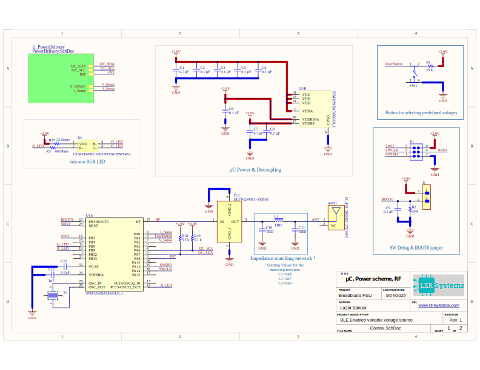
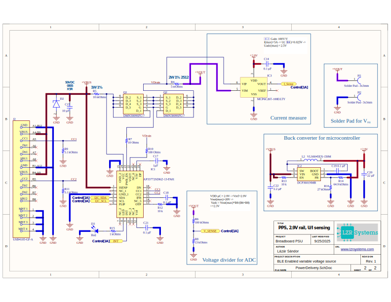
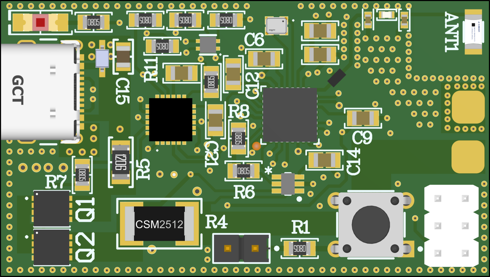
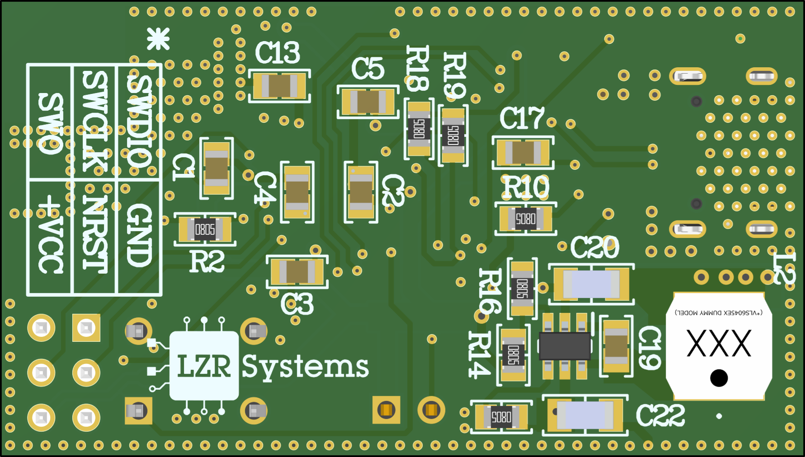

### NANOPSU is a USB PPS based small form factor Voltage source for powering electronics projects. It's using an STM32 WB-series controller for BLE connectivity as main UI. Predefined voltages can be set using the onboard toggle switch.

## ✈️Features
- **USB-C PPS**
- **BLE Connectivity using the STM32WBA55 μC**
- **Current, Voltage sensing**
- **Onboard toggle switch for setting predefined voltages  (1.8V, 3.3V, 5V, 9V, 12V, 16V)**
- **Small form factor**
- **Onboard RGB LED for feedback**
- **Reverse current protection**
- **OCP, OVP**
- **Fully customizable Voltage table and debug via SWD**

## ⚙️Hardware
**Microcontroller: STM32WBA55KGU6**
- 32-bit Arm® Cortex®-M33 core with TrustZone®
- Up to 100 MHz CPU frequency
- 512 kB Flash memory
- 128 kB SRAM
- Integrated Bluetooth® Low Energy 5.3 radio (2 Mbps, LE Audio, long-range, AoX)
- Security: Arm TrustZone®, AES, PKA, RNG, SHA, secure boot
- 12-bit ADC up to 16-channels
- Low-power modes with <1 µA standby
- Rich peripherals: I²C, SPI, USART, LPUART, LPTIM, timers, RTC
- Debug: SWD, SWO, ETM trace
- Package: QFN-32

**USB PD Sink Controller: AP33772S**
- USB Power Delivery (PD) 3.0 / 3.1 sink controller
- Supports Fixed, PPS (Programmable Power Supply), and AVS (Adjustable Voltage Supply) contracts
- Input voltage range: 3.3V - 24V
- I²C interface for voltage/current request and monitoring
- Integrated protections: OVP, UVP, OCP, OTP
- Drives back-to-back N-channel MOSFETs for VBUS control (reverse current blocking)
- Configurable power levels via NVM registers or I²C commands
- Package: QW-QFN4040-24

**DCP3601NMR Buck converter for μC power/logic rail**

**CLMUD-FKC RGB LED**

## 🚀 Quick start
- Plug into a USB-C PPS capable charger
- Set output voltage via BLE app or toggle switch
- RGB LED indicates active voltage preset

4. RGB LED indicates state/voltage (see table below):

| Voltage | LED color   |
| ------- |  ---------  |
| **1.8 V**   | $${\color{white}WHITE}$$ 
| **3.3 V**   | $${\color{red}RED}$$       |
| **5 V**     | $${\color{green}GREEN}$$   |
| **9 V**     | $${\color{blue}BLUE}$$     |
| **12 V**    | $${\color{cyan}CYAN}$$     |
| **16 V**    | $${\color{pink}PINK}$$     |
### **Still waiting for board, stay tuned**

## ☢️Safety
- ### **Max theoretical output current: 5A (Limited by PD spec)**
- ### **Device defaults to 1.8V upon loss of power/restart**

## 🔜Code
### Still waiting for board, stay tuned

## 📝Schematic
### μC

### Power Scheme

## 🧰PCB 3D Render

## 💾Repository Contents
- `*.SchDoc` - Altium schematic files  
- `*.PcbDoc` - Altium PCB file  
- `GERBER/` - Gerber outputs (for fabrication)  
- `Pictures/` - Schematics and board previews (SVG, PNG)